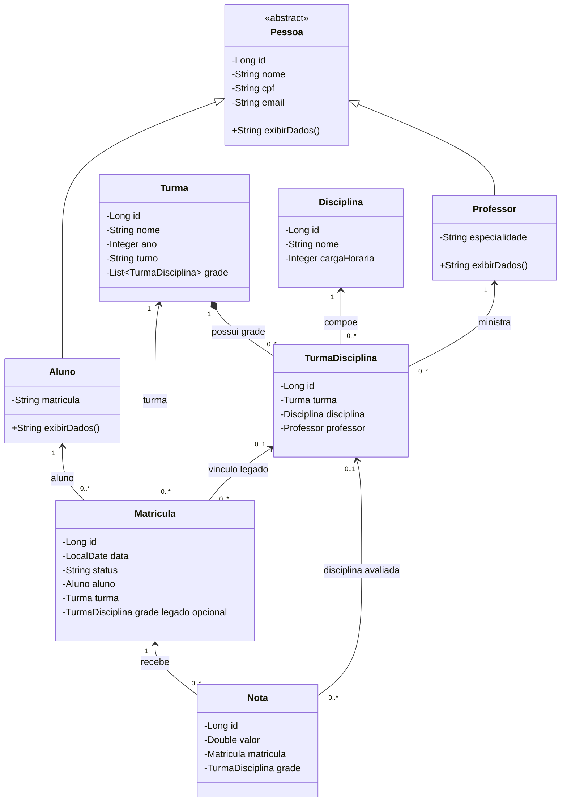

# Diagrama de Classes

Diagrama baseado no modelo atual do sistema escolar.

## Fluxo do domínio

1. `Turma` é criada com nome, ano e turno.
2. `TurmaDisciplina` vincula uma disciplina e um professor à turma.
3. `Matricula` vincula um aluno à turma.
4. `Nota` registra o valor da avaliação para uma matrícula em uma disciplina da grade.

## Principais operações

- `POST /api/turmas`: cria uma turma básica.
- `POST /api/turmas/{turmaId}/grade`: vincula disciplina e professor à turma.
- `GET /api/turmas/{turmaId}/grade`: lista a grade da turma.
- `POST /api/matriculas`: matricula aluno na turma.
- `POST /api/notas`: registra uma nota individual.
- `POST /api/notas/lote`: registra várias notas de uma turma e disciplina.
